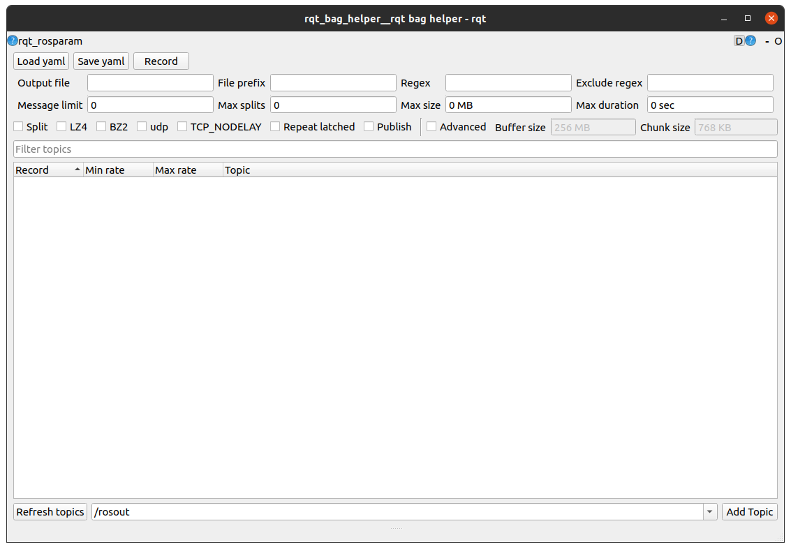
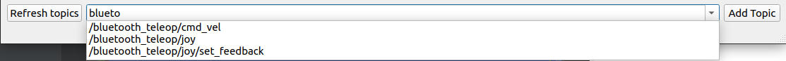
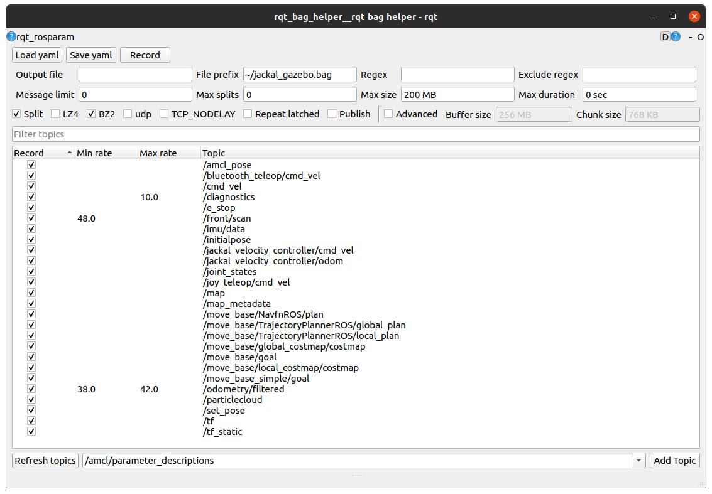

# rqt_bag_helper

A GUI to load topics from a yaml file, select which ones you want to record in the bag, and monitor them while the bag is recording.

# Usage

To start, you will need to have a roscore running. Then, run

```bash
rosrun rqt_bag_helper rqt_bag_helper
```

You will see a user interface like this



## Setting recording args

Each of the boxes for arguments corresponds to an argument to the `rosbag record` script. You can mouse over the input boxes to see the purpose of the argument, which comes from the output of `rosbag record -h`.

## Manually adding topics

To add a topic to record, use the box at the bottom of the window. On start, the box will be populated with topics that exist on the roscore at that time. Use the refresh button to update to the latest topics. You can add topics which are not present on the current roscore by typing the desired topics into the box.

Typing in the box will also filter the available topics, which you can add from the dropdown.



## Filtering topics

Once you have added some topics, you can filter these by using the filter topics box.

## Setting min/max rate for monitoring

The min and max rate columns in the view are used when the record button is pressed. These columns will show if the given topic is within the expected rate.
- If a cell is green, the topic is within the expected range.
- If a cell is red, the topic is not within the expected range.
- If a cell is black, the topic has never received a message.
- If a cell is grey, the topic has not received a message in the last rate monitoring period.
- If a cell is white, the topic received at least one message in the last rate monitoring period (default is 2 seconds). 

You can edit the values used by double-clicking the column and entering a value.

You do not have to set both a minimum and maximum rate. If only max rate is set, anything below that rate is good. If only min rate is set, anything above that rate is good. If both min and max are set, the rate of the topic must be between those values to be good.

## Yaml configurations

The main purpose of this tool is to be able to load and save yaml configurations of rosbag record tasks that you do regularly.

Once you have set up the topics and arguments as you want them, use the save yaml button to save a yaml file.

When saving a file, the current configuration will be written to the file. Unchecked topics will not be written to the file.

If you have an existing file, you can load with the load yaml button. You can see an example file at [jackal_example.yaml](resource/example/jackal_example.yaml).

# Worked example

This is an example yaml configuration file that you might use for a jackal simulation, found at [jackal_example.yaml](resource/example/jackal_example.yaml).

```yaml
args: # same names as the arguments to rosbag record
  bz2: true
  duration: 0
  exclude: ''
  limit: 0
  lz4: false
  max-splits: 0
  output-name: ''
  output-prefix: ~/jackal_gazebo.bag
  publish: false
  regex: ''
  repeat-latched: false
  size: 200
  split: true
  tcpnodelay: false
  udp: false
topics: # A list of topics to display in the interface
- /amcl_pose # topics can be plain list elements
- /bluetooth_teleop/cmd_vel
- /cmd_vel
- name: /diagnostics # alternatively, you can use keys to define min/max rates
  rate:
    max: 10.0
- /e_stop
- name: /front/scan
  rate:
    min: 48.0
- /imu/data
- /initialpose
- /jackal_velocity_controller/cmd_vel
- /jackal_velocity_controller/odom
- /joint_states
- /joy_teleop/cmd_vel
- /map
- /map_metadata
- /move_base/NavfnROS/plan
- /move_base/TrajectoryPlannerROS/global_plan
- /move_base/TrajectoryPlannerROS/local_plan
- /move_base/global_costmap/costmap
- /move_base/goal
- /move_base/local_costmap/costmap
- /move_base_simple/goal
- name: /odometry/filtered
  rate:
    max: 42.0
    min: 38.0
- /particlecloud
- /set_pose
- /tf
- /tf_static
```

For most topics, we are not interested in monitoring the rate, but there are a few which we want to make sure are within some rate bounds, otherwise it's likely that something is wrong.

 To provide a realistic example of a rosbag that you might record, we'll use a jackal simulation. To run the jackal simulation, you will need [jackal packages](https://github.com/jackal/jackal) and [jackal simulator](https://github.com/jackal/jackal_simulator) in your workspace.

Start the simulator with

```bash
roslaunch --wait jackal_gazebo empty_world.launch world_name:=`rospack find jackal_gazebo`/worlds/jackal_race.world front_laser:=true
```

And then amcl with

```bash
roslaunch --wait jackal_navigation amcl_demo.launch map_file:=`rospack find jackal_navigation`/maps/jackal_race.yaml
```

Then, start the rqt bag helper

```bash
rosrun rqt_bag_helper rqt_bag_helper
```

And load the yaml. You will see something like



